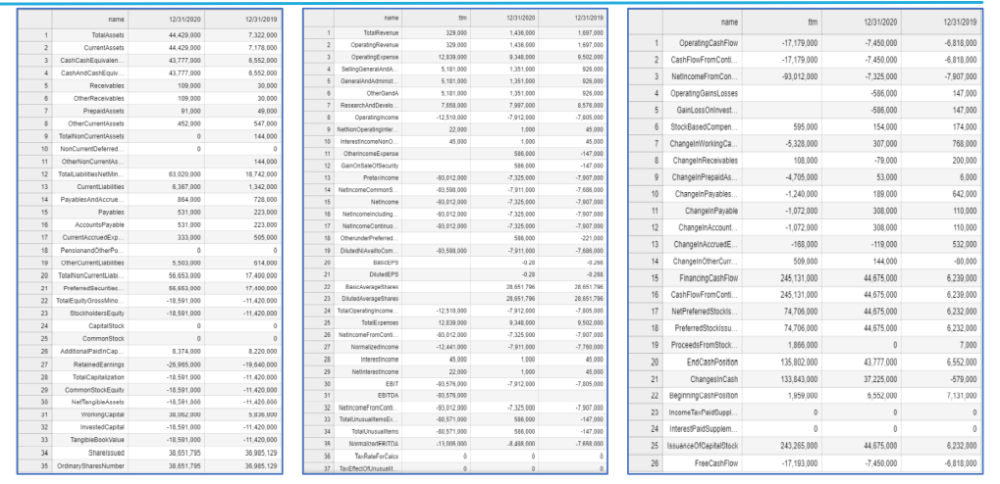
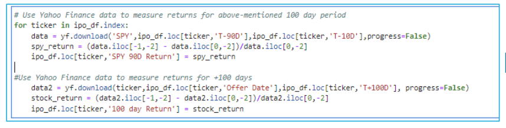
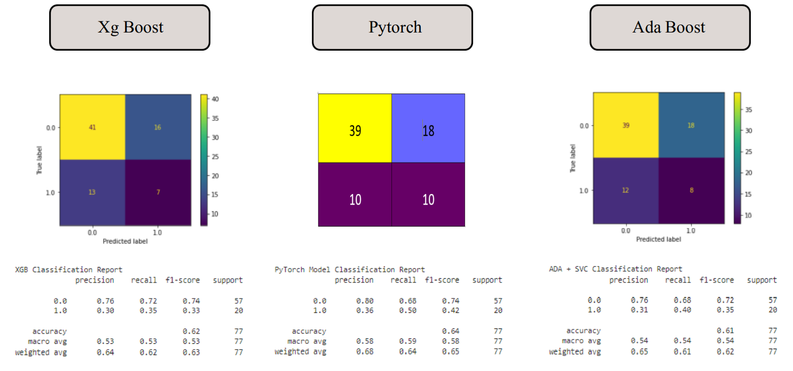
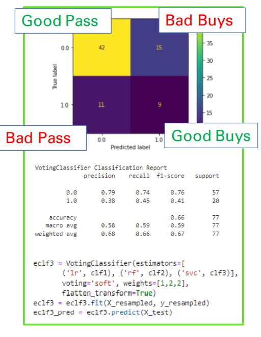
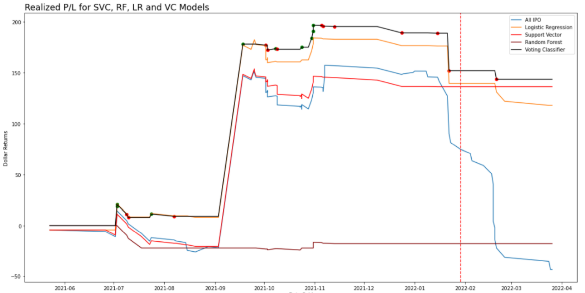
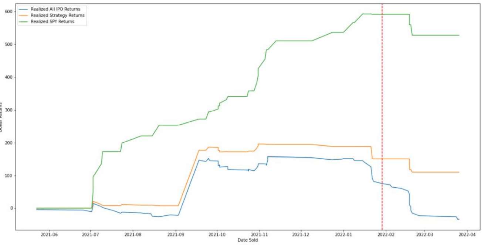

# IPO Scooper

TJ McDowell, Chris Kwiatkowski, Troy Albany, Edward Schryver

---
## Scope and Origin

The IPO Scooper is a trading strategy developed using various machine learning and nuro network models to analyze financials of IPOs prior to there offer date. By correlating key features in the financials, we can run a model that decides if there’s potential to predict market gains. This example utilizes IPOs from 2021 to back test the strategy. Due to the fact that IPOs do not have a large amount of financial data prior to the IPO, we would see many stocks that would not be included. This however is not necessarily bad as it eliminates risk.

Our selected test models included Xg Boost, Pytorch, Ada Boost, and Voting Classifiers which combines Support Vector Classification, Random Forest, and Logistic Regression. Though the SVC from the VC model performed more accurately than the rest we must identify that this was under great overall market conditions. With the S&P seeing 27% returns in 2021 it was very likely that this would trickledown in to IPOs bringing in volatility. 

---

## Data Preparation

For this project, we gathered financial statements (Balance Sheet, Income Statement, Cash Flow Statement) for IPO stocks from 2021 and combined them into one dataset. We create a model that used all of the information to predict whether or not it would be a profitable decision to invest in the IPO. If the model decided it would be profitable after 100 days, it told us to buy 1 share and sell it at the close of the market 100 days later. If it predicted it would not be profitable, it told us to do nothing. 

---

## Results

This section displays various models (XGboost, Pytorch, ADAboost) to see  which, if any,  would give better results. Results were mixed as none showed superiority. We then ran an ensemble model (Voting Classifier)combining the best probabilities from other models to see if there were better predictions .

The Voting Classifier Model told us to buy the IPO a total of 24 times. Only 9 of those would have resulted in a profit after 100 days, resulting in a low precision of 0.38 for buys.  In actuality there were 20 occasions in all when a buy would have resulted in a profit. This resulted in a low recall of 0.45 for buys.  The model was much better at predicting when not to buy as it told us 53 times not to buy, and was corect 42 of them, resulting in a precision of 0.79 for passes. The total amount of times where a buy would have resulted in a loss was 57, so the recall for passes was a 0.74. 

## Conclusion

This chart shows the realized gains for five different outcomes. Each line shows what our profits/losses would have been if we had purchased one share of the IPO, held it for 100 days after the IPO hit the market, and then sold it at the close of the 100th day.  The light blue line serves as the baseline, showing how we would have performed if we had gone in on every single IPO of 2021. The remaining lines represent show how we would have performed if we followed the predictions, or instructions of our different models that we created.  The orange, red, and maroon lines are the models that make up the components of the voting classifier model. The vertical line here represents current day, since our strategy is to sell the stock 100 days after the IPO, some of them extend out to the future. As the chart shows, the Voting Classifier Model performed the best, giving us the best return by the time we would have sold our final IPO stock.  The green and red dots represent our sells of the stock, the green resulting in a realized gain, and the red resulting in a realized loss.

This chart compares the baseline of going in on all of the IPOs, the performance of our strategy, but this one we added in the green line which represents what the returns would have been if every time our model told us to buy an IPO, we would have bought 1 share of the SPY ETF. And as you can see although following our model would have resulted in a profit, it would not have performed as well as if we just invested into the overall market.

